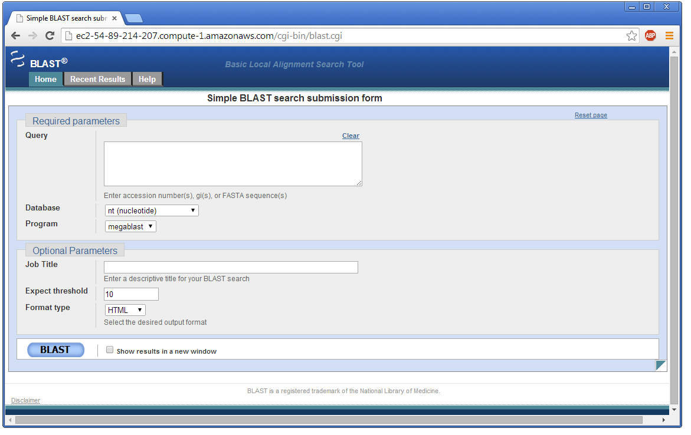
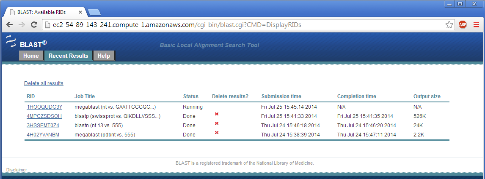

To run WebBLAST on the instance you [started at AWS]({{ site.baseurl }}), simply point your web browser at the Public DNS of your instance with the suffix `cgi-bin/blast.cgi`:

**Note**: You will need to [authenticate]({{ site.baseurl }}) the first time you access this URL.

By clicking on the 'Recent Results' tab near of the top of the page you will be able to see the BLAST searches that have run on this instance, their status, and access their results:

