An account is required with Amazon Web Services (AWS). As cloud providers rapidly change their product offerings, please consult their cloud documentation first.

1. Start at the [NCBI BLAST home page](https://blast.ncbi.nlm.nih.gov) and click on "Use BLAST in the cloud".
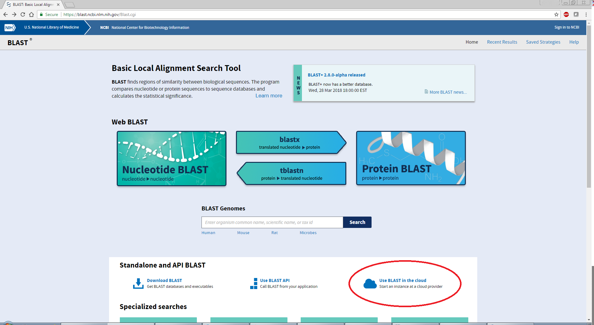

2. Click on the [AWS marketplace link](https://aws.amazon.com/marketplace/pp/B00N44P7L6).
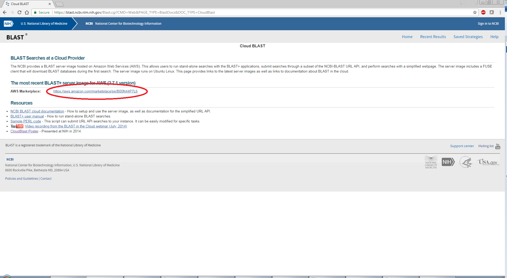

3. Click on **'Continue to Subscribe'**. (What does it mean to [subscribe](https://aws.amazon.com/marketplace/help/200799470)?)
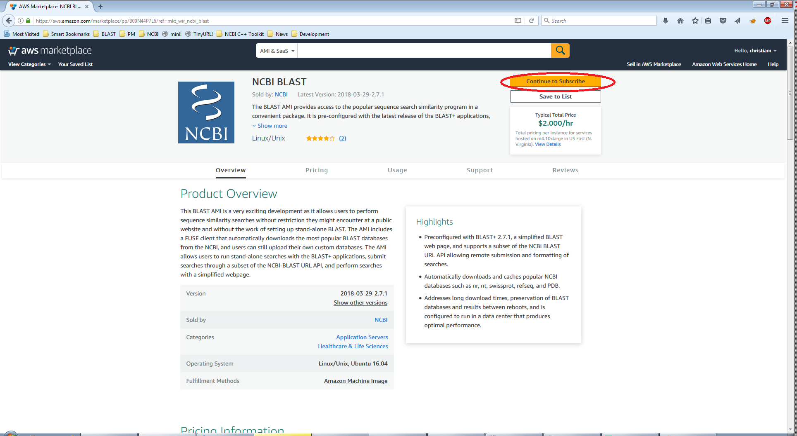

4. Login with your AWS credentials (requires sign up and credit card information).
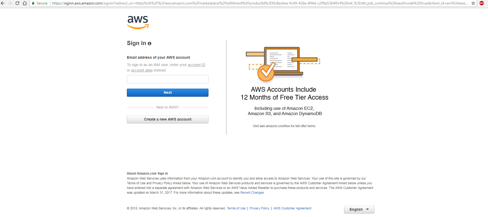

5. Select **'Launch with 1-click'** yellow button (circled in red, see 5a below).  
The 1-Click-Launch option is configured by default to start a `m4.10xlarge` instance (40 vCPUs, 160 GB RAM, EBS volumes, $2/hr), which is large enough (as of 06/08/2018) to run searches against the nr and nt BLAST databases and store the results in the instance's local disk.  
FIXME: need to mention that alternate screens may show up, and show them.
Recommendations: 
* Use an instance with EBS volumes if you intend to stop or reboot the instance.
* Start the instance in the `us-east-1` region, as it is closest to NCBI and the BLAST database downloads will be the fastest.
Machine type can be changed using the area highlighted in green (see 5b below and adjusted hourly price).
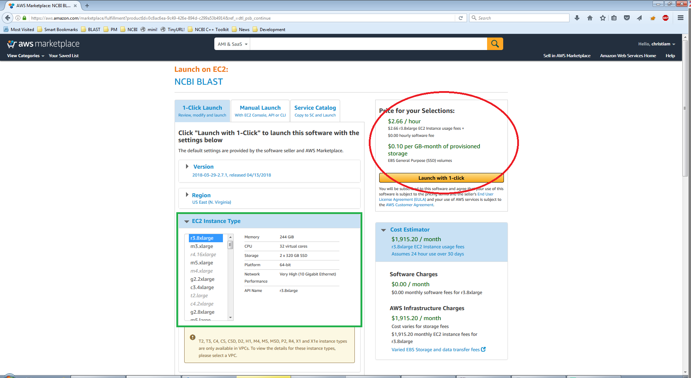5a
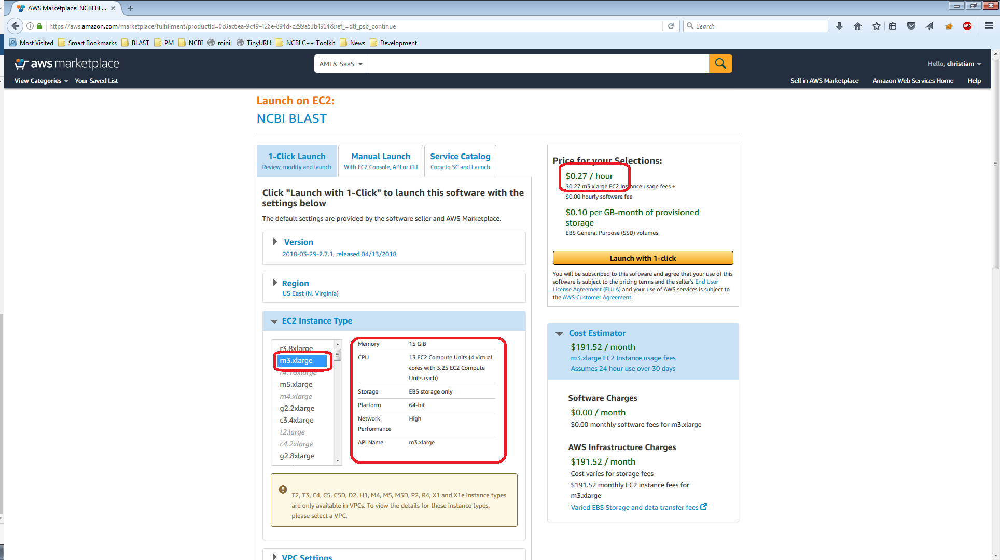5b 
**NOTE**: If you want to [login to the instance via ssh]({{site.baseurl}}), please be sure to set the proper Key Pair and open the required ports to enable access. If this is not needed, no worries! You can still access the web application via the web browser.

6. A confirmation page will appear. To get the URL of your instance, follow the "Console" link (highlighted in red below). This is also accessible via the [AWS console](https://console.aws.amazon.com/ec2/).
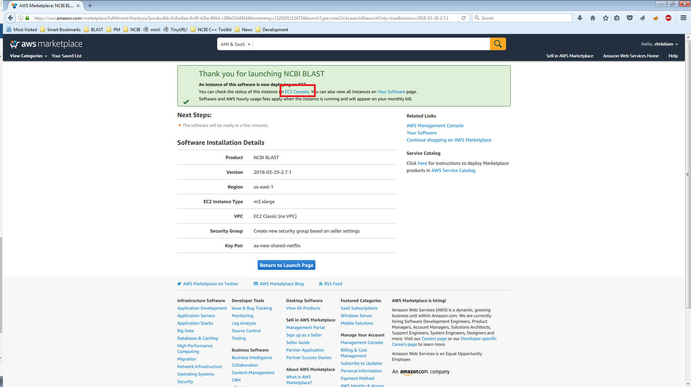

7. In the AWS console, follow the link to **'Running Instances'**.

8. Identify your running instance. One way of achieving this is as follows:
 * Sort the instances by descending launch time (newest first); since yours is likely to be at/near the top.
 * Copy the public DNS for the machine _and_ the instance ID.
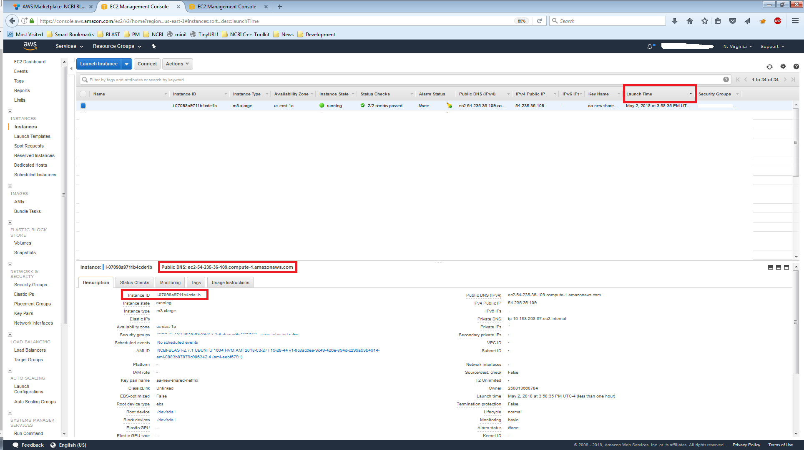

9. Paste the public DNS into your web browser.
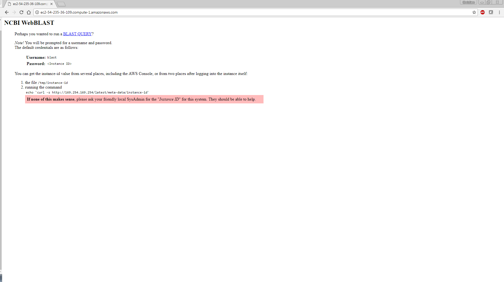

10. Click on **'BLAST QUERY'** and in the 'Sign in' window enter: **User name** - 'blast' and **Password** - (instance ID from the previous step):
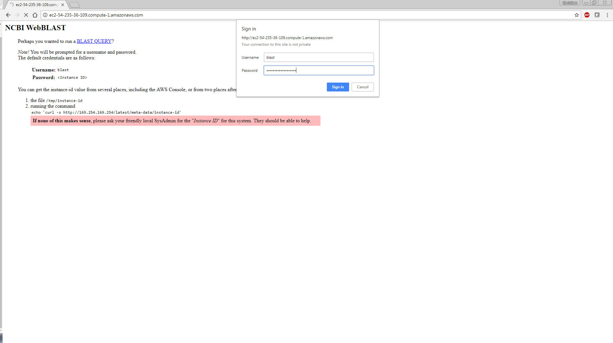

11. You are all set! Run BLAST to your heart's content :)
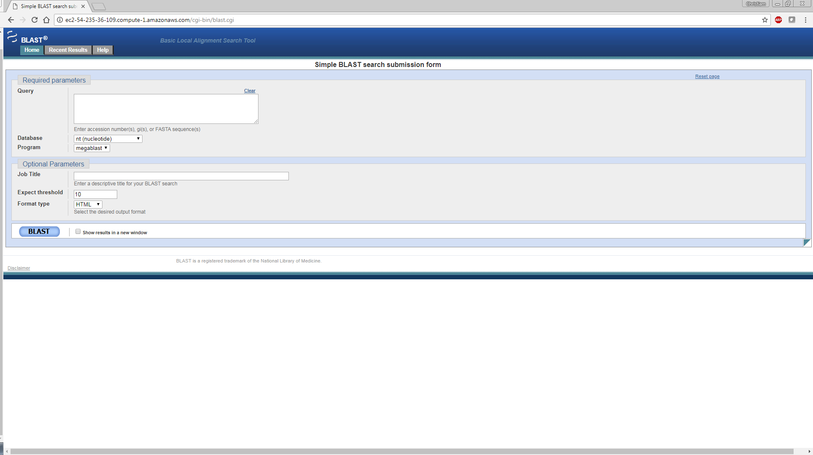

