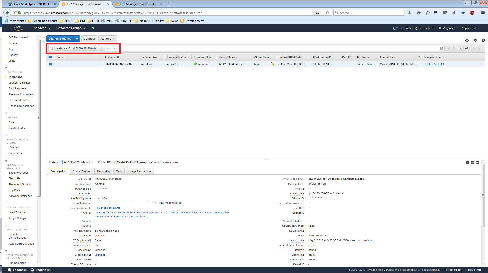
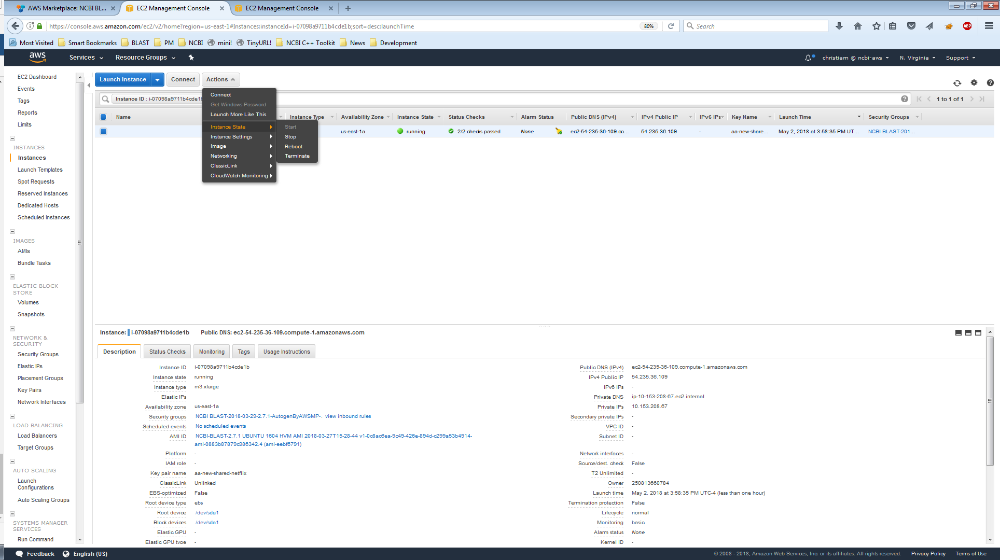
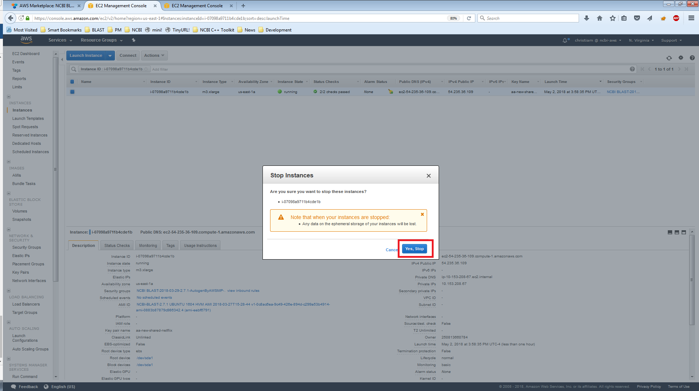
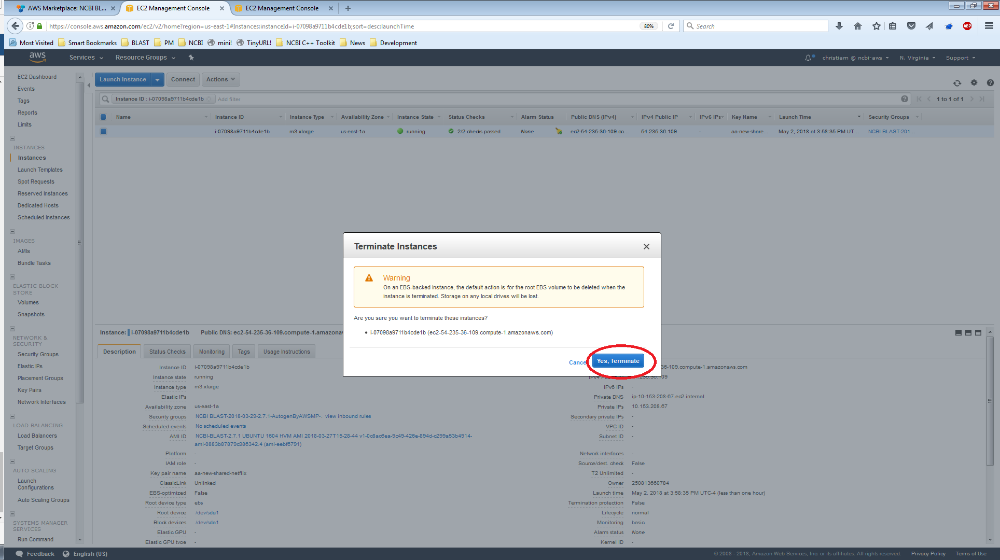

**WARNING**: You may want to download your BLAST results before terminating the instance, as once this is done, all the contents of the instance will be lost.

**NOTE**: _Stoppage_ allows the instance to be stopped and re-started at a later time. Any previously computed BLAST results will still be available once the instance is re-started. AWS will only charge a small fee for storage of the data in an EBS volume.

**NOTE**: _Termination_ of instance is permanent, all data stored in the instance is lost forever. 

1. Login to the [AWS console](https://console.aws.amazon.com/ec2).

2. Identify the instance you would like stop **OR** terminate (tip: use the instance ID as a means to filter the listing of running instances).

3. Click on 'Actions -> Instance State -> Stop' **OR** 'Actions -> Instance State -> Terminate'.

4. Confirm the Stop (4a) **OR** termination(4b).
4a
4b

